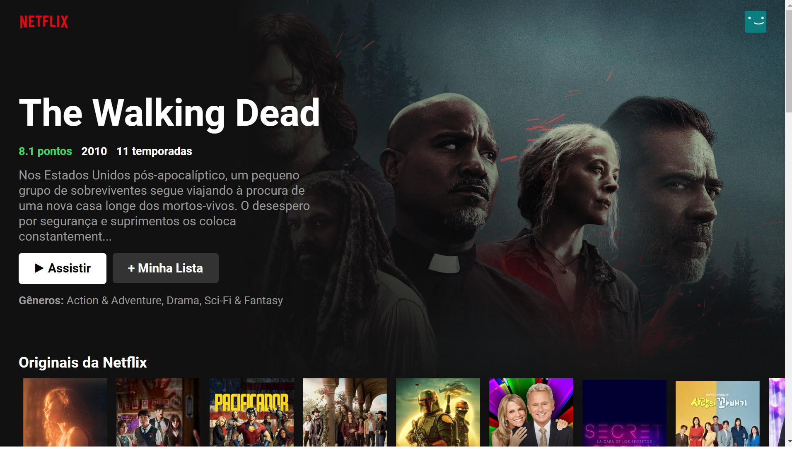

# Netflix by Jefferson Willian

## Sobre o Projeto

Esse projeto foi criado com o framework React, a fim de estudos, refazendo o site da Netflix.

### Como inicializar?

Primeiro, é necessario ter o Node instalado [Node](https://nodejs.org/en/)

Faça um clone do repositorio com o comando abaixo::
### `git clone https://github.com/Jefferson-W/NetflixClone.git`

Para instalar as dependências use :
### `npm install`

Agora, basta digitar o comando abaixo, para rodar no localhost:3000
### `npm start`

Abra seu browser e acesse o link abaixo:
[http://localhost:3000](http://localhost:3000)

### Visual do Projeto finalizado

 

    
    

### Feito Com

Abaixo segue o que foi utilizado na criação do projeto:

- [React](https://pt-br.reactjs.org/) - O React JS é um framework que permite o desenvolvimento de aplicações  utilizando Javascript;

- [Fetch](https://developer.mozilla.org/pt-BR/docs/Web/API/Fetch_API/Using_Fetch) - Para utilizar a API foi utilizado o método fetch(). Ele retorna uma promessa. Se a promessa retornada for resolve , a função dentro do método then() é executada. Essa função contém o código para lidar com os dados recebidos da API.